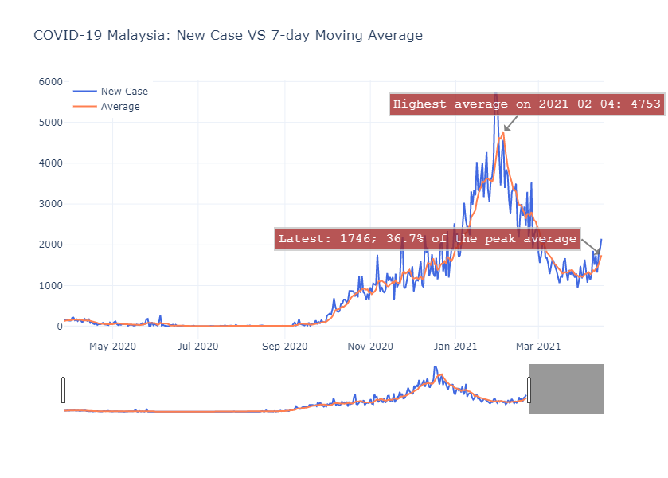
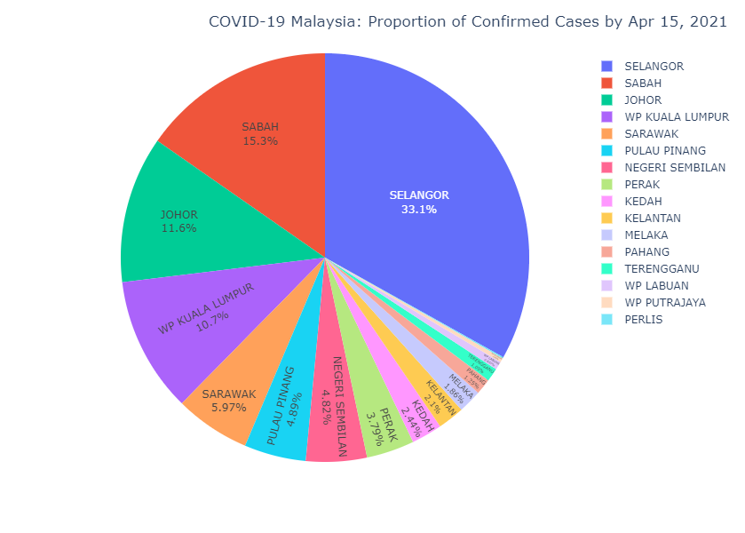
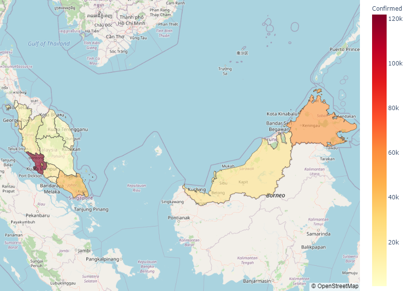

# COVID-19 Malaysia Visualizations

## Built with

<code></code>
<code></code>
<code></code>
<code></code>

<code></code>
<code></code>

## Summary
This project is intended to display some interactive visualizations for COVID-19 cases in Malaysia. The data consists of the number of cases from 27 Mar, 2020 until 15 Apr, 2021. All of the data is scraped from https://kpkesihatan.com/ by using the `BeautifulSoup` library. 

The motivation for this project is to create better and interactive plots for the people to see the overview of the COVID-19 cases in Malaysia more clearly.

## Web Application
There is a Web App that can be accessed [here](https://share.streamlit.io/ansonnn07/covid19-malaysia/main/app.py) which you can directly see all the visualizations made.

## Some Visualizations

